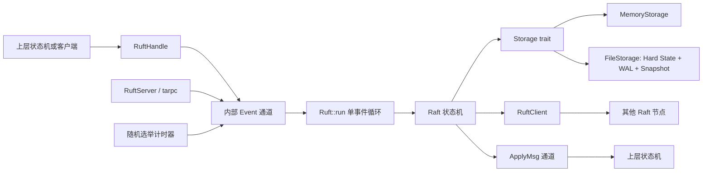

# ruft

`ruft` 是一个基于 Rust 异步生态实现的 Raft 共识库。项目聚焦于 Raft 的核心路径：选主、日志复制、提交与状态机应用、持久化恢复，以及日志压缩和快照安装。

它不是一个完整的 KV 数据库或生产级分布式系统；它为上层状态机提供可靠的日志复制基础。上层应用提交命令字节，节点在多数副本确认后通过 apply 通道按顺序交付已提交命令。

## 技术栈

| 领域       | 使用技术               | 用途                                              |
| ---------- | ---------------------- | ------------------------------------------------- |
| 编程语言   | Rust 2024 Edition      | 类型安全、所有权和无数据竞争并发模型              |
| 异步运行时 | Tokio                  | 节点事件循环、计时器、通道、并发任务和 TCP I/O    |
| RPC        | tarpc + tokio-serde    | 基于 TCP 的 Raft RPC 服务与客户端                 |
| 序列化     | serde + bincode        | RPC 消息、日志条目、硬状态、快照和 WAL 记录编码   |
| 持久化     | 文件系统 + 自定义 WAL  | Hard State 原子写入、日志重放、CRC 校验和快照恢复 |
| 测试与基准 | cargo test + Criterion | 单元测试、真实 TCP 集成测试和 KV 场景基准         |

## 项目亮点

- **单事件循环状态机**：RPC、选举超时、心跳、客户端命令和复制响应均被转换为内部事件，再由 `Ruft::run` 串行修改状态，避免多个异步任务直接竞争 Raft 内部状态。
- **真实网络验证**：测试并非只模拟函数调用，而是使用 `tarpc` 和 TCP 启动多个节点，覆盖选主、日志复制、leader 故障转移和网络分区恢复。
- **Raft 日志一致性处理**：Follower 校验 `prev_log_index` 与 `prev_log_term`；出现冲突时以 Leader 日志替换本地冲突后缀。
- **符合任期约束的提交**：Leader 仅推进已复制到多数派、且属于当前任期的日志，避免仅根据副本数量提交旧任期条目。
- **可恢复持久化**：任期和投票记录使用临时文件、同步和 rename 原子更新；日志采用含 magic header、记录长度和 CRC 的 WAL，重启时可回放并恢复尾部半写。
- **快照与压缩基础**：支持本地创建快照、压缩已应用日志，以及通过 `InstallSnapshot` 向落后节点传输快照。
- **内存与文件存储抽象**：Raft 状态机只依赖 `Storage` trait，可在 `MemoryStorage` 和 `FileStorage` 之间切换。

## 架构



一个节点的关键状态包括：

- 持久状态：`current_term`、`voted_for`、日志和快照。
- 所有节点的易失状态：`commit_index`、`last_applied`。
- Leader 易失状态：每个 Follower 的 `next_index`、`match_index`。
- 日志采用从 1 开始的 Raft 索引，内部保留一个空哨兵条目以简化边界处理。

## 已实现能力

### 选主与角色转换

- Follower、Candidate、Leader 三种角色。
- 随机化选举超时，降低多个节点同时竞选的概率。
- Candidate 自增任期、持久化自投票，并并发广播 `RequestVote`。
- 投票时按最后日志任期和索引比较候选人日志的新旧程度。
- 收到更高任期的 RPC 或投票结果后，节点持久化新任期、清空投票并退回 Follower。
- 成为 Leader 后初始化所有 Follower 的复制进度并立即触发复制。

### 日志复制与提交

- Leader 通过 `AppendEntries` 同时实现心跳和日志复制。
- Follower 会拒绝陈旧任期、越界前置索引和前置任期不匹配的请求。
- 发生日志冲突时，Follower 原子替换冲突索引之后的本地后缀。
- Follower 的提交点不会超过本地实际存在的最后日志。
- Leader 基于 `match_index` 计算多数派复制进度，并只提交当前任期的条目。
- 已提交日志以 `ApplyMsg::Command` 的形式按索引顺序发送给上层状态机。

### 快照与日志压缩

- 上层状态机可对已应用索引调用 `RuftHandle::create_snapshot`，保存状态机快照并压缩日志前缀。
- Follower 落后于 Leader 快照边界时，Leader 会选择 `InstallSnapshot` 而不是发送无法匹配的旧日志。
- Follower 安装快照后更新快照边界、提交和应用进度，并以 `ApplyMsg::Snapshot` 通知上层重建状态。

### 持久化与恢复

- `HardState` 保存当前任期和本任期投票对象。
- `FileStorage` 使用单段 WAL 持久化日志追加、后缀替换和压缩基线。
- 每条 WAL 记录带有长度和 CRC；完整记录校验失败会以数据损坏拒绝启动。
- 允许恢复时截断文件尾部不完整记录，保留此前所有完整记录。
- 快照和硬状态均通过临时文件、同步写入和 rename 更新。
- 节点重新创建时会从 `hard_state`、WAL 和快照恢复状态。

## 目录说明

```text
src/
  ruft/       Raft 节点状态机、角色和对外运行时句柄
  rpc/        tarpc 定义、客户端集合和服务端事件转发层
  storage/    Storage trait、内存实现、文件 WAL 与快照实现
  events/     串行状态机使用的内部事件类型
  result/     客户端追加结果类型
  utilis/     随机选举计时器
tests/
  raft_integration.rs              基础 TCP 集成测试
  log_conflict_repair.rs           旧 Leader 未提交尾部冲突修复
  network_partition_recovery.rs    多数派分区选主与恢复
benches/
  kvserver.rs                      Criterion 基准
```

## 快速开始

### 环境要求

- Rust toolchain，支持 Rust 2024 Edition。
- 本机可用的 TCP loopback 网络环境。

### 构建与测试

```bash
cargo build
cargo test
```

运行指定的网络场景：

```bash
cargo test --test raft_integration
cargo test --test log_conflict_repair
cargo test --test network_partition_recovery
```

运行基准：

```bash
cargo bench
```

## 测试覆盖

测试包括 52 个单元测试和 6 个集成测试，覆盖：

- 三节点选出唯一 Leader 并复制日志。
- Follower 拒绝客户端直接写入。
- 多条命令按提交顺序复制并应用。
- Leader 停止后，剩余节点重新选主并继续提交。
- 文件存储节点重启后恢复任期和日志。
- 网络分区后，多数派选出新 Leader。
- 被隔离旧 Leader 的未提交日志被多数派 Leader 的日志覆盖。
- WAL 后缀替换、压缩、快照恢复、尾部半写恢复和 CRC 损坏检测。

### 开发机基准结果

基准位于 `benches/kvserver.rs`，使用 Criterion 测量三节点 TCP 集群处理一次 KV `SET` 的端到端提交延迟。一次操作包含：KV RPC 接收、Leader 追加日志、向多数派复制、提交、状态机 apply，以及将结果返回给发起请求的客户端。

在以下开发机环境执行基准：

| 项目          | 配置                                                |
| ------------- | --------------------------------------------------- |
| 操作系统      | Windows 11 Home 中文版，10.0.26200                  |
| CPU           | 12th Gen Intel Core i5-1240P，12 核 / 16 逻辑处理器 |
| 内存          | 15.7 GiB                                            |
| 节点与网络    | 3 个本机 TCP Raft 节点，loopback 网络               |
| 存储模式      | `MemoryStorage`，不包含文件 `fsync` 成本            |
| 并发客户端    | 1                                                   |
| Tokio runtime | 4 个 worker 线程                                    |

基准程序支持两个命令行参数：

- `clients=N`：每次迭代并发提交 $N$ 个独立的 KV `SET` 请求，默认 `N=1`。
- `persistent`：切换至 `FileStorage`。该模式会执行 WAL 与 hard state 的同步写入，包含本机磁盘持久化开销。

本次执行的命令为：

```bash
cargo bench --bench kvserver
cargo bench --bench kvserver -- clients=8
cargo bench --bench kvserver -- persistent
cargo bench --bench kvserver -- persistent,clients=8
```

| 存储模式   | 并发客户端 | Benchmark                                                 | 每轮耗时区间     | 每轮中位估计 | 吞吐区间              | 吞吐中位估计   |
| ---------- | ---------- | --------------------------------------------------------- | ---------------- | ------------ | --------------------- | -------------- |
| 内存       | 1          | `three_node_tarpc_tcp/memory,clients=1/kv_set_commit`     | 131.43-137.40 us | 133.76 us    | 7.2781-7.6084 K ops/s | 7.4760 K ops/s |
| 内存       | 8          | `three_node_tarpc_tcp/memory,clients=8/kv_set_commit`     | 413.56-462.20 us | 437.35 us    | 17.309-19.344 K ops/s | 18.292 K ops/s |
| 文件持久化 | 1          | `three_node_tarpc_tcp/persistent,clients=1/kv_set_commit` | 2.5823-2.6755 ms | 2.6293 ms    | 373.76-387.25 ops/s   | 380.34 ops/s   |
| 文件持久化 | 8          | `three_node_tarpc_tcp/persistent,clients=8/kv_set_commit` | 12.805-13.328 ms | 13.068 ms    | 600.25-624.76 ops/s   | 612.20 ops/s   |

表中的“每轮耗时”对应一轮 benchmark 迭代：当 `clients=8` 时，一轮包含 8 个同时发起的 `SET` 请求，而吞吐量已按操作数归一化。因此，并发场景应主要比较吞吐量，不应将每轮耗时直接视为单个请求延迟。

结果表明，在本机 loopback 和内存存储条件下，8 客户端并发将端到端吞吐提升至约 `18.29 K ops/s`；启用文件持久化后，WAL 同步写入成为主要成本，单客户端吞吐约为 `380 ops/s`，8 客户端并发约为 `612 ops/s`。这些数据仅用于展示当前实现的可复现基线，不应视为跨机器网络、其他磁盘、不同操作系统或生产负载下的性能承诺。

## 后续改进方向

1. 完善快照安装后尾部日志追赶的功能，明确处理快照与并发复制响应的顺序关系。
2. 为每个 Follower 引入复制请求序号或单飞控制，避免乱序 RPC 响应回退已推进的复制进度，产生不必要的通信开销。
3. 增加 proposal 提交确认与线性一致读接口。
4. 支持成员变更、日志分段、快照策略、指标与更丰富的故障注入测试。